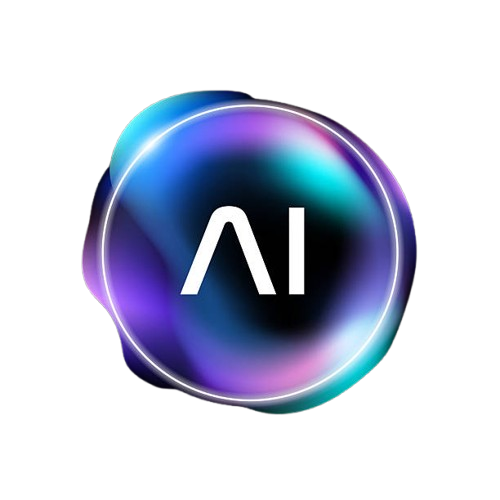

<p align="center">
  
</p>

<p align="center">
  
  &nbsp;&nbsp;&nbsp;&nbsp;
  
</p>

<h1 align="center">Azure AI Fundamentals (AI-900)</h1>
<h3 align="center">Per Scholas - May 2026</h3>

<p align="center">
  <a href="https://learn.microsoft.com/en-us/credentials/certifications/azure-ai-fundamentals/">
    
  </a>
  <a href="https://ai.azure.com/">
    
  </a>
</p>

---

## About This Repository

Welcome to the Azure AI Fundamentals course learner repository. This is your central hub for all course materials, updated and maintained by your instructor.

Each module folder contains **Markdown (.md)** files you can read directly on GitHub with fully clickable links. A separate **`PDF/`** folder contains PDF versions of every file for offline use and printing.

---

## Important Updates for Learners

### Links Updated (May 2026)

The links provided in **Canvas** for Microsoft Learn labs and badges are **outdated**. Many of the original URLs have been retired or redirected by Microsoft. All links in this repository have been **verified and corrected** to point to the current, working Microsoft Learn modules.

**Use the links in this repo instead of Canvas** for all lab activities (GLABs) and badge assignments (POCs).

### Azure AI Studio is Now Azure AI Foundry

Microsoft has renamed **Azure AI Studio** to **[Azure AI Foundry](https://ai.azure.com/)**. If you see references to "Azure AI Studio" in Canvas or older materials, it is the same platform now called **Azure AI Foundry**. All materials in this repo have been updated to reflect this change.

### Hands-On Lab Links

Several of the original lab links pointed to "describe" modules that only contained reading material with no exercises. These have been replaced with **hands-on modules** that include interactive exercises and Azure sandbox environments, giving you actual practice with the tools.

### AI-900 Exam Retirement Notice

> Microsoft has announced that the **AI-900: Azure AI Fundamentals** exam will be **retired on June 30, 2025** and replaced by the **[AI-901: Microsoft Azure AI Fundamentals](https://learn.microsoft.com/en-us/credentials/certifications/azure-ai-fundamentals/)** exam. The core topics remain similar, but the new exam includes updated content around **Azure AI Foundry** and **generative AI**. Schedule your exam before the transition if you want to take the AI-900 version.

---

## Course Modules

| Module | Topic | Content |
|--------|-------|---------|
| **MODULE 251** | Cloud Computing and Azure Fundamentals | 3 Lessons, 6 GLABs |
| **MODULE 260** | AI and Machine Learning Fundamentals | 2 Lessons, 1 GLAB, 3 POCs |
| **MODULE 261** | Computer Vision | 2 Lessons, 4 GLABs, 1 POC |
| **MODULE 262** | Natural Language Processing (NLP) | 3 Lessons, 5 GLABs, 3 POCs |
| **MODULE 263** | Document Intelligence and Knowledge Mining | 1 Lesson, 2 GLABs, 2 POCs |
| **MODULE 264** | Generative AI | 1 Lesson, 3 GLABs, 2 POCs |
| **MODULE 265** | AI-900 Certification Exam Preparation | Exam Guide, Voucher Process, 3 Practice Exams, 2 Qualification Exams |

---

## Repository Structure

```
Azure_AI_Fundamentals_5_2026/
├── README.md
├── MODULE_251/          # Markdown files (clickable links on GitHub)
├── MODULE_260/
├── MODULE_261/
├── MODULE_262/
├── MODULE_263/
├── MODULE_264/
├── MODULE_265/
└── PDF/                 # PDF versions (download for offline use/printing)
    ├── Course_README.pdf
    ├── MODULE_251/
    ├── MODULE_260/
    ├── MODULE_261/
    ├── MODULE_262/
    ├── MODULE_263/
    ├── MODULE_264/
    └── MODULE_265/
```

---

## How to Use

1. **Browse on GitHub** - Navigate to any module folder and click on `.md` files to read them with clickable links.
2. **Download PDFs** - Go to the `PDF/` folder for printable versions of all materials.
3. **Download Everything** - Click the green **Code** button above, then **Download ZIP**, or clone:
   ```bash
   git clone https://github.com/akarales/Azure_AI_Fundamentals_5_2026.git
   ```

---

## File Types

| Type | Description |
|------|-------------|
| **Lesson** (`lesson_XXX.Y.md`) | Course content, lecture notes, and reference material |
| **GLAB** (`GLAB XXX.Y.Z - Name.md`) | Guided Lab activities with hands-on exercises on Microsoft Learn |
| **POC** (`POC XXX.Y.Z - Name.md`) | Proof of Completion badge assignments on Microsoft Learn |
| **All Links** (`all_links.md`) | Quick reference with all links for a module (Canvas, labs, badges) |
| **Complete Guide** (`MODULE_XXX_Complete_Guide.pdf`) | Combined PDF with all lesson content for a module |

---

## Key Resources

| Resource | Link |
|----------|------|
| **Azure AI Foundry Portal** | [ai.azure.com](https://ai.azure.com/) |
| **Azure Portal** | [portal.azure.com](https://portal.azure.com/) |
| **Microsoft Learn** | [learn.microsoft.com](https://learn.microsoft.com/) |
| **AI-900 Certification Page** | [Azure AI Fundamentals Certification](https://learn.microsoft.com/en-us/credentials/certifications/azure-ai-fundamentals/) |
| **Azure Pricing Calculator** | [Azure Pricing Calculator](https://azure.microsoft.com/en-us/pricing/calculator/) |

---

## Instructor

**Alexandros Karales** (He/Him)
Technical Instructor (Lead AI & Data Analytics) - Per Scholas

---

*Last updated: May 2026*
